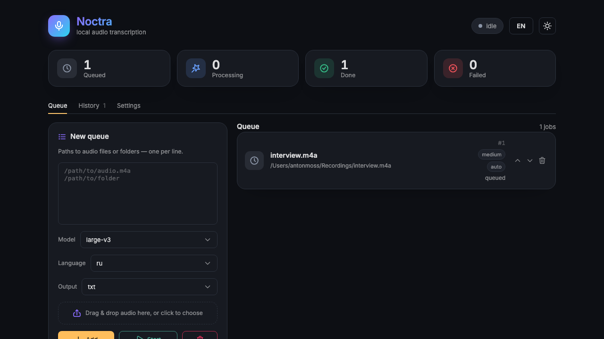

# Noctra

Local, sequential audio transcription queue with a minimal web UI. Runs
[faster-whisper](https://github.com/SYSTRAN/faster-whisper) on your own machine —
no cloud, no upload, no per-minute billing.



## What it does

Point Noctra at audio files (or whole folders), and it transcribes them one by
one into `.txt` files next to the originals. A small web UI shows the queue and
progress; a headless CLI mode is available too. You can also drag & drop audio
straight into the UI — uploads are stored under `.noctra/uploads`.

- Formats: audio (`.m4a`, `.mp3`, `.wav`, `.flac`, `.ogg`, `.opus`) and video
  (`.webm`, `.mp4`, `.m4v`, `.mov`, `.mkv`, `.avi` — the audio track is transcribed)
- Output: `clip.m4a` → `clip.txt` (written atomically); optional `.srt` / `.vtt`
  subtitles with timestamps, selectable per queue
- Default model: `large-v3`, language `ru`, CPU / `int8`
- Pick the Whisper model per queue from the UI (`tiny` … `large-v3`)
- Choose the transcription language per queue, or `auto` to detect it
- UI available in English (default) and Russian — toggle in the header

## Requirements

- Python ≥ 3.12
- [`uv`](https://docs.astral.sh/uv/) (package manager / runner)
- `ffmpeg` available on PATH (required by faster-whisper)

## Quick start (Docker / Podman)

One command, then open <http://localhost:8787>:

```bash
docker compose up --build      # or: podman compose up --build
# shortcut: make up   (override engine: COMPOSE="podman compose" make up)
```

Drop audio into `./audio` on the host and reference it as `/data/<file>` in
the UI. Downloaded models are cached in a named volume, so the first run
downloads the model once and later runs start instantly.

## Quick start (local, no container)

```bash
make install        # create venv, install deps (incl. dev tools)
make model          # download & cache the Whisper model (first run only)
make serve          # open http://127.0.0.1:8787
```

Interactive API docs are served at `/docs` (OpenAPI). Or transcribe files
headless, without the UI:

```bash
make run FILES="~/recordings/a.m4a ~/recordings/folder"
```

## Configuration

Settings resolve as **CLI flag → environment (`NOCTRA_*` / `.env`) → default**.

| Setting       | CLI flag          | Env var               | Default     |
|---------------|-------------------|-----------------------|-------------|
| Model         | `--model`         | `NOCTRA_MODEL`        | `large-v3`  |
| Language      | `--language`      | `NOCTRA_LANGUAGE`     | `ru`        |
| Device        | `--device`        | `NOCTRA_DEVICE`       | `cpu`       |
| Compute type  | `--compute-type`  | `NOCTRA_COMPUTE_TYPE` | `int8`      |
| Host          | `--host`          | `NOCTRA_HOST`         | `127.0.0.1` |
| Port          | `--port`          | `NOCTRA_PORT`         | `8787`      |
| Queue DB path | —                 | `NOCTRA_DB_PATH`      | `.noctra/queue.db` |
| Upload dir    | —                 | `NOCTRA_UPLOAD_DIR`   | `.noctra/uploads`  |

The queue is persisted to SQLite, so it survives restarts. Jobs interrupted
mid-transcription are automatically re-queued (`processing` → `pending`) on the
next start. In containers the DB lives in the `noctra-data` volume.

## Deployment

### GPU (CUDA)

If you have an NVIDIA GPU and the
[NVIDIA Container Toolkit](https://docs.nvidia.com/datacenter/cloud-native/container-toolkit/latest/),
run the CUDA image (uses `device=cuda`, `compute_type=float16`):

```bash
docker compose -f compose.cuda.yaml up --build      # shortcut: make up-cuda
```

Without containers, just point the config at your GPU:

```bash
make serve DEVICE=cuda COMPUTE_TYPE=float16
```

### Install as a CLI

The project ships a `noctra` entry point, so you can install it as a global tool:

```bash
make install-cli            # uv tool install --force .
noctra --serve              # or: noctra ~/recordings/a.m4a  (headless)
```

### Autostart on macOS (launchd)

A launchd agent template lives at `deploy/com.noctra.plist`. Replace the two
`__PLACEHOLDER__` values (repo path and `which uv`), then:

```bash
cp deploy/com.noctra.plist ~/Library/LaunchAgents/com.noctra.plist
launchctl load ~/Library/LaunchAgents/com.noctra.plist     # unload to stop
```

Noctra then starts at login and restarts on crash.

## Development

```bash
make check          # ruff + mypy + pytest (with coverage)
make test
make lint
make typecheck
```

Logs are written to `.noctra_logs/`.

### Releasing

`make release` cuts the **next minor version automatically** — no manual version
edits. From a clean `main` it:

1. bumps the version to `X.(Y+1).0` in `pyproject.toml` + `src/noctra/__init__.py`;
2. regenerates the `CHANGELOG.md` section from the commit subjects since the last tag;
3. runs `make check`, then commits, tags `vX.(Y+1).0` and pushes.

Pushing the tag triggers CI to build & push the multi-arch Docker image to GHCR
and to create the GitHub Release from that CHANGELOG section. Preview first with
`make release-dry`.

### Frontend

The UI is a React + Vite + [Gravity UI](https://gravity-ui.com/) app in
`frontend/`. The committed `web/dist/` build is served by the backend, so you
can run Noctra without Node. To work on the UI:

```bash
make frontend-install     # one-time
make frontend-dev         # Vite dev server, proxies /api and /ws to :8787
make frontend-build       # rebuild web/dist (commit the result)
```

Run a backend (`make serve`) alongside `make frontend-dev` for live reload.

## Project layout

```
src/noctra/
  domain.py        # Job model + statuses (framework-agnostic core)
  paths.py         # audio discovery, output naming
  config.py        # settings (pydantic-settings)
  queue_store.py   # thread-safe queue (write-through to SQLite)
  persistence.py   # SQLite job repository
  engine.py        # faster-whisper wrapper
  worker.py        # background transcription thread
  api/             # FastAPI app, routes, schemas
  cli.py           # entry points / run modes
frontend/          # React + Vite + Gravity UI source
web/dist/          # built SPA (served by the backend)
tests/             # pytest suite for the core
Dockerfile         # CPU image          Dockerfile.cuda      # GPU image
compose.yaml       # CPU compose        compose.cuda.yaml    # GPU compose
deploy/com.noctra.plist                 # macOS launchd autostart template
```
